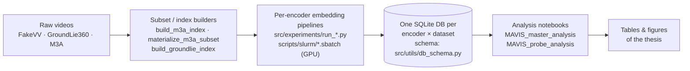

# [MAVIS — Multimodal Alignment Verification In Short-videos](MAVIS.pdf)

> Bachelor's Final Project (TFG) in Artificial Intelligence — Universitat Autònoma de Barcelona.
> Author: **Luis Domene García**. Supervisor: Ernest Valveny.
> 📄 **[Read the full thesis (PDF)](MAVIS.pdf)**

MAVIS is an empirical study of a single question: **can off-the-shelf, single-vector
multimodal video embeddings flag misinformation through cross-channel semantic alignment —
without external evidence?** Short-form video misinformation is dominated not by deepfakes
but by *authentic footage mis-accompanied*: a real clip paired with a false title or a
statement taken out of context. We measure whether the cosine between a video and the text
around it can catch that.

The headline result is **negative with a measured cause**: cross-channel similarity is a
real signal *as a within-pair comparison* (it reliably ranks the authentic pairing above the
fake one), but it does **not** survive as a single deployable threshold, because each
manipulation shifts the embedding far less than ordinary variation between videos. A second
contribution is **methodological**: a bias-audit protocol (TF-IDF/style floors, a
type×modality control matrix, within- and cross-dataset validity tests) that separates
genuine cross-modal signal from dataset-construction artefact.

The study spans **three datasets** (FakeVV, GroundLie360, M3A) and **four encoders**
(Gemini Embedding 2, Qwen3-VL-Embedding 2B/8B, WAVE-7B).

This repository contains **only the source code** needed to reproduce the study. Raw videos,
model weights and the embedding databases are large binary artifacts and are *not* shipped;
they are regenerated by the pipelines below.

## How the pipeline fits together



Each encoder embeds every channel (`video`, `title`/`summary`, `transcript`, plus per-scene
segments) **offline** and writes one SQLite database per *(encoder × dataset)*. Those vectors
are the single source of truth; the analysis notebooks read **only** from the databases and
produce every number, table and figure in the report.

## Repository layout

```
src/                              Reusable Python package
  utils/db_schema.py              SQLite schema for the embedding databases (the contract)
  experiments/run_*.py            Embedding generators, one per (encoder × dataset)
  experiments/build_m3a_index.py  Seeded, stratified subset selection for M3A
  experiments/materialize_m3a_subset.py
  evaluation/                     Cross-encoder comparison

experiments/
  <dataset>/                      Per-dataset embedding-generation notebooks
  GroundLie360/build_groundlie_index.ipynb   Dataset/index construction
  analysis/
    MAVIS_master_analysis.ipynb   Master analysis: every zero-shot result, table and figure
    MAVIS_probe_analysis.ipynb    Supervised linear-probe audit
    mavis_analysis.py             Shared helpers used by the notebooks (all functions live here)
    title_bias_audit/             The construction-bias audit (TF-IDF/style floors, type×modality)
    research_ideas/run_H*.py      Follow-up probes (e.g. H6 = cross-dataset transfer)

scripts/
  cluster/                        Sync/run/monitor helpers for the SLURM cluster (PowerShell)
  slurm/                          GPU job scripts (.sbatch) for the encoders and preprocessing
  setup/                          Conda env + model download scripts
  preprocessing/                  Window / scene-embedding builders (temporal experiments)

environment.yml                   Pinned conda environment (CPU analysis + GE2 / Qwen pipelines)
MAVIS.pdf                         The final thesis
```

**Datasets and where they are built.** *FakeVV* and *M3A* are large and algorithmically
generated; *GroundLie360* is real-world (Snopes) and qualitatively rich. The M3A subset is
fixed by `src/experiments/build_m3a_index.py` (+ `materialize_m3a_subset.py`); the
GroundLie360 index by `experiments/GroundLie360/build_groundlie_index.ipynb`.

**Encoders.** GPU encoders (Qwen3-VL, WAVE) run on the cluster via the matching
`scripts/slurm/*.sbatch`; the API encoder (Gemini Embedding 2) runs from
`src/experiments/run_*_ge2.py`. WAVE needs its own environment
(`scripts/setup/create_env_wave.sh`).

## Reproducing the study

1. **Environment**

   ```bash
   conda env create -f environment.yml
   conda activate mavis
   ```

2. **Embeddings.** Each encoder writes one SQLite database per *(encoder × dataset)*. Example
   (Gemini Embedding 2 on M3A):

   ```bash
   python src/experiments/run_m3a_ge2.py \
       --data-dir data/M3A \
       --output-dir experiments/M3A/google_embeddings2/results \
       --index-json experiments/M3A/m3a_index_2500.json
   ```

   GPU encoders run on the cluster via the matching `scripts/slurm/*.sbatch`. The notebooks
   under `experiments/<dataset>/` document the embedding-generation path for each encoder.

3. **Analysis.** Open the two notebooks under `experiments/analysis/`; they read only from the
   databases and reproduce the results exactly:

   ```
   experiments/analysis/MAVIS_master_analysis.ipynb   # zero-shot results, ladder, tables/figures
   experiments/analysis/MAVIS_probe_analysis.ipynb    # supervised probe + bias audit
   ```
